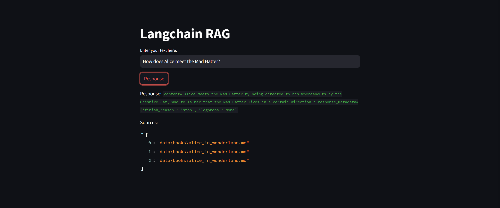

# LLM-RAG-Chatbot

## Description:

The create_database.py script provides a framework for generating a text embedding data store using LangChain and Chroma. It leverages OpenAI's API to create embeddings for text chunks extracted from Markdown documents within a specified directory.

The app.py application creates a simple question-answering interface using Streamlit, LangChain, Chroma, and OpenAI. It leverages a pre-generated text embedding database (Chroma) to retrieve relevant text chunks for a given query and then formulates a response using OpenAI's Chat model.

Model Used: 'gpt-3.5-turbo'

## Installation:

- Prerequisites: Ensure you have Python 3.10 and `pip` installed.
- Install Dependencies:
   ```bash
   pip install -r requirements.txt
   ```

## Configuration:

- Environment Variable:
   Create a file named `.env` in your project directory and add the following line, replacing `<YOUR_OPENAI_API_KEY>` with your actual OpenAI API key:

     ```
     OPENAI_API_KEY=<YOUR_OPENAI_API_KEY>
     ```

   Load the environment variables using `dotenv`:

     ```python
     import os
     from dotenv import load_dotenv

     load_dotenv()
     ```

- Data Directory:
   Modify the `DATA_PATH` variable in the code to point to the directory containing your Markdown documents. The script assumes documents have a `.md` extension.

## Create the Chroma DB:

- Execute:
   ```bash
   python create_database.py
   ```
Usage:

- This script serves as a template to create a text embedding data store for Markdown files.
- Modify the `DATA_PATH` variable to point to your specific data directory.
- Ensure you have an OpenAI API key and set the `OPENAI_API_KEY` environment variable accordingly.

## Query the Chroma DB.
- Execution:
   ```bash
   streamlit run app.py
   ```

Usage:

1. Access the app in your web browser (usually at http://localhost:8501 by default).
2. Enter a query in the text box.
3. Click the "Response" button.
4. The app will:
   - Retrieve relevant text chunks from the Chroma database.
   - Compose a prompt for OpenAI's Chat model using the retrieved context and query.
   - Generate a response using the Chat model.
   - Display the generated response and the sources of the retrieved text chunks.
  
## Working


